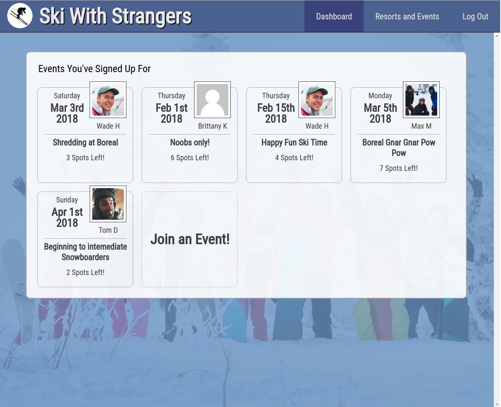
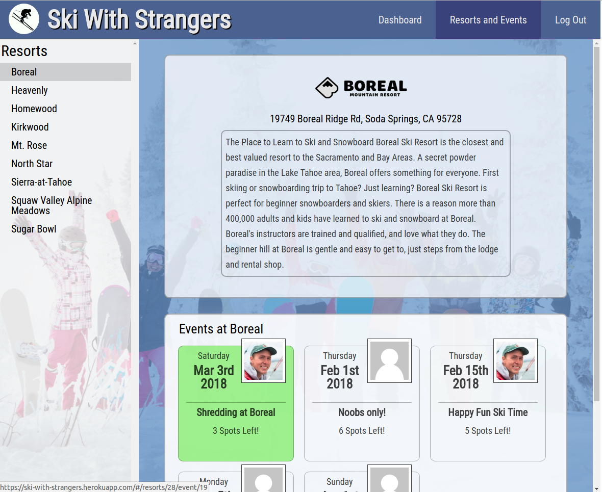
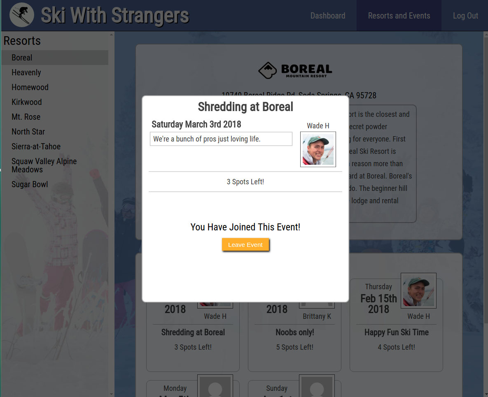

# SkiWithStrangers

[SkiWithStrangers live][heroku]

[heroku]: https://ski-with-strangers.herokuapp.com/#/

SkiWithStrangers is a web application based on TeaWithStrangers.
It was built using Ruby on Rails and React/Redux.

## Features & Implementation

### Dashboard

The dashboard rendered via the `Dashboard` component is what the user
sees upon logging in/signing up. It contains the events that the user
has joined. The user may investigate the events they've
joined and leave them if they wish.

### Viewing Events and Resorts

Resorts and events are stored in two separate tables in the database.
The resorts table contains the resort's `id`, `name`, `address`, `description`,
and `logo_url` while the events table contains the event's `id`, `title`,
`body`, `date`, `capacity`, the related `resort_id`, and `host_id`.

The resorts and events page is rendered in a total of 3 different components:
1. `ResortsIndex`
2. `ResortDetail`
3. `Events`

On the left is the `ResortsIndex` which displays a list of resort names.
When a resort name is clicked, it renders the `ResortDetail` for that resort
as well as the related `Events` to the right in the main area.

The UI for the resorts and events page is loosely based off Evernote's
note UI.

### Joining/Leaving Events

Joining events is managed through the use of two components:

1. `EventDetail`
2. `AttendanceForm`

To join an event, the user must press on an event on the resorts and events
page or the dashboard. When an event is clicked, `EventDetail` renders
the appropriate information as well as an `AttendanceForm` used to keep
track of the users who are attending each event.

The `AttendanceForm` interacts with the attendances join table
in the back end which contains `id`, `user_id`, and `event_id`.

## Work to be Done in the Future

### Event Creation and Editing

Create `HostForm` and allow approved users to create events.
